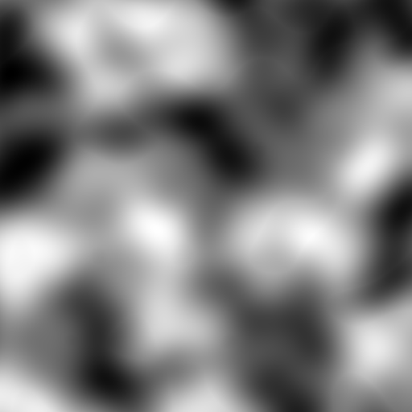

# Biome Distribution (Definition Reference)

This directory configures **where** biomes generate (the 2D/3D map from world coordinates to a
biome id). For an individual biome's terrain/palette/features, see the [`biomes/`](../biomes/)
directory instead.

```
biome-distribution/
  presets/      Biome-provider presets (one is selected in pack.yml)
  stages/       Pipeline mutation stages (climate, spots, rivers, …)
  extrusions/   3D extrusion stages (cave-biome placement by Y)
```

Contents:

1. [Branch vs base legend](#branch-vs-base-legend)
2. [The provider chain (top level)](#the-provider-chain-top-level)
3. [The CHIMERA pipeline, stage by stage](#the-chimera-pipeline-stage-by-stage)
4. [Stage types & examples](#stage-types--examples)
5. [Extrusions (3D / cave biomes)](#extrusions-3d--cave-biomes)
6. [Tuning distribution](#tuning-distribution)
7. [Screenshot placeholders](#screenshot-placeholders)

> The hard-won **balancing knowledge** (which levers compress the rare-biome ratio, the flatness
> gate, sealevel-locked biomes, runaway-biome patterns) lives in
> [agents.md → Biome Distribution Balancing](../agents.md#biome-distribution-balancing--reference).
> This file defines the *mechanism*; agents.md captures the *tuning experience*.

See the legend in [math/README.md](../math/README.md#branch-vs-base-legend): 🟢 = base
Polydev Terra, 🔶 = diytechy Terra fork / CHIMERA addon.

---

## Branch vs base legend

The pipeline-provider concept, stage types (`REPLACE`, `REPLACE_LIST`, `FRACTAL_EXPAND`,
`SMOOTH`, …), and the `EXTRUSION` provider are 🟢 **base** Terra. CHIMERA layers several
🔶 **fork** features on top:

- 🔶 `provider.structure-search` fast-path (stronghold-ring search optimisation).
- 🔶 `y-blend` on the EXTRUSION provider (per-column Y warp so cave-biome boundaries follow
  terrain instead of flat planes).
- 🔶 Special-cave extrusion system (`add_special_caves.yml`) and rift regions
  (`special/build_rift_regions.yml`).

---

## The provider chain (top level)

`pack.yml` selects a preset under `biomes:`. CHIMERA uses
[`presets/CHIMERA.yml`](presets/CHIMERA.yml), whose structure is:

```yaml
biomes:
  type: EXTRUSION            # 🟢 wraps a 2D provider and adds 3D (cave) biome layers
  extrusions:                # cave biome layers applied by Y range
    - << extrusions/add_deep_dark.yml:extrusions
    - << extrusions/add_cave_biomes.yml:extrusions
    - << extrusions/add_special_caves.yml:extrusions   # 🔶
  y-blend: { ... }           # 🔶 per-column Y warp (see legend)
  provider:
    type: PIPELINE           # 🟢 the 2D surface-biome provider
    resolution: 4            # sampled every 4 blocks
    structure-search: { ... }# 🔶 stronghold-search fast path
    blend: { ... }           # boundary jitter sampler
    pipeline:
      source: { ... }        # the starting biome set
      stages: [ ... ]        # ordered mutations (see below)
```

- **`source`** seeds the map with a coarse set of tokens (here: `_ocean_spot`, `_non_spot`,
  `_land_spot`) via a `spotPlacer` sampler. 🟢
- **`stages`** run top-to-bottom; each rewrites tokens produced by earlier stages. 🟢

---

## The CHIMERA pipeline, stage by stage

The exact order from `presets/CHIMERA.yml` (this is the source of truth — reproduced here for
navigation). Each stage's file is in `stages/`.

| # | Stage (file) | Input → Output | Notes |
|---|---|---|---|
| 0 | `source` (inline `spotPlacer`) | seed → `_ocean_spot` / `_non_spot` / `_land_spot` | Coarse spot mask. |
| 1 | inline `REPLACE` on `_non_spot` | `_non_spot` → `ocean` / `land` | Split by `continentalDistribution`. |
| 2 | `add_spots.yml` | land/ocean → + mesa / volcano / coastal spots | Large POI placement. |
| 3 | `special/build_rift_regions.yml` 🔶 | → rift/canyon temperature regions | Pre-classifies rift cells. |
| 4 | `Distribute_Major_Regions.yml` | land → land / vast-forest / island / special carves | Carves special placements (`SELF:N` ratios). |
| 5 | `climate/temperature.yml` | land/ocean → 12 temperature bands | `REPLACE_LIST` by `BiomeShape*Temperature`. |
| 6 | `climate/precipitation.yml` | each temperature → 6 precipitation bands | `REPLACE_LIST`. |
| 7 | `climate/elevation.yml` | each climate → flat / lowlands / highlands | **Not weighted** — uses a flatness gate. |
| 8 | `climate/color.yml` | climate color variants | |
| 9 | `add_travertine_terraces.yml` | terrace overlays | |
| 10 | `set_biomes_in_climates_origen.yml` | climate sub-region → concrete BIOME ids | **The big one** — every climate's biome menu. |
| 11 | `add_biome_color_variants.yml` | biome → color variants | e.g. maple-groves → 3 maple colors. |
| 12 | `special/border_biomes.yml` | adds edge biomes between regions | |
| 13 | `add_coast.yml` | overlays coast biomes | |
| 14 | 4× `FRACTAL_EXPAND` (WHITE_NOISE) | boundary roughening | 🟢 dissolves blocky borders. |
| 15 | `add_rivers.yml` | overlays rivers | |
| 16 | `add_trenches.yml` 🔶 | overlays ocean trenches | |

Stages 5–7 are the **climate cascade**: temperature → precipitation → elevation. Each partition
multiplies the previous, so a single mis-weighting compounds (see agents.md balancing notes).

---

## Stage types & examples

All stage types are 🟢 base Terra. The ones CHIMERA uses heavily:

### `REPLACE` — swap one token for a weighted menu, selected by a sampler

```yaml
- type: REPLACE
  from: mesa
  sampler:
    type: EXPRESSION
    expression: BiomeShapeMesaTemperature(x, z)   # selector field
  to:                                             # weighted list, partitioned by sampler value
    - ice-cap-mesa: 4
    - polar-mesa: 1
    - boreal-mesa: 1
    # ...
```

The selector sampler's output range is partitioned across the weighted `to:` list — colder
sampler values pick earlier entries. `SELF: N` keeps the parent token for N of N+1 (bigger N =
rarer replacement), the idiom used for carving in `Distribute_Major_Regions.yml`.

### `REPLACE_LIST` — apply the same partition to many parent tokens at once

```yaml
- type: REPLACE_LIST
  sampler:
    type: EXPRESSION
    expression: BiomeShapeLandmassTemperature(x, z)
  default-from: land                 # default parent
  default-to:                        # default menu (YAML anchors reused below)
    - ice-cap: &iceCap 4
    - tundra: &tundra 1
    - boreal-snowy: &borealSnowy 4
    # ...
  to:                                # per-parent overrides (island, ocean, …)
    island:
      - polar-island: *iceCap
      - island: *borealCold
      # ...
```

This is the climate cascade idiom: define the band weights once as anchors, reuse them for every
parent region (land, island, ocean, mesa, crater-lake, sinkhole, …) so all regions share the
same temperature/precipitation gradient.

### `FRACTAL_EXPAND` — roughen boundaries

```yaml
- type: FRACTAL_EXPAND
  sampler: { type: WHITE_NOISE }
```

Repeated several times to break up the blocky cell boundaries from the coarse source map.

### The climate elevation gate (special)

`climate/elevation.yml` does **not** partition by weight. It segments on a `flatness` value:

```
if elevation > highlands  -> HIGHLANDS
elif flatness < flatnessFactor -> LOWLANDS
else -> FLAT
```

The actual FLAT share is controlled by `forced-sealevel-activation-threshold` in
[customization.yml](../customization.yml), **not** by `flatness-factor`. This is the single
biggest lever for the marsh/swamp/bog floor — see
[agents.md → Flatness gate](../agents.md#flatness-gate--the-most-important-thing-to-understand).

---

## Extrusions (3D / cave biomes)

Extrusions add biomes in a Y range on top of the 2D surface map. 🟢 The provider is `EXTRUSION`;
each file under `extrusions/` contributes layers:

| File | Adds | Branch |
|---|---|---|
| `add_deep_dark.yml` | Deep Dark layer | 🟢 |
| `add_cave_biomes.yml` | Standard cave biomes (`STANDARD_CAVES` pool) | 🟢 |
| `add_special_caves.yml` | Special caves (Inferno Isle, Vine Vault, …) by Y range | 🔶 |

> **Carving does not blend, terrain does** — extruded cave biomes must use *carving* (not
> terrain samplers) for their hollows, and the extrusion Y-range must be **wider** than the
> carver's active zone. Both are detailed in
> [agents.md → Special Caves / Carving Reference](../agents.md#special-caves--carving-reference). 🔶

---

## Tuning distribution

Levers in order of blast radius (full discussion in agents.md):

1. `forced-sealevel-activation-threshold` (customization.yml) — FLAT zone share.
2. `climate/temperature.yml` weights — every biome in a temperature band.
3. `climate/precipitation.yml` weights — e.g. `desertBorder` feeds steppe biomes.
4. `Distribute_Major_Regions.yml` `SELF: N` carve ratios — special-feature density.
5. Intra-climate weights in `set_biomes_in_climates_origen.yml` — finest tuning.

**Benchmarking:** `benchmark_CHIMERA.csv` holds sampled surface/subsurface counts and %; the
build (`.scripts/AuditAndPackage.bat`) also emits `.artifacts/BiomeTable.csv` with exact
per-preset percentages. See agents.md for column meanings and statistical caveats.

> ⚠️ **Never edit the YAML configs and then build over them silently** — per the project rule,
> propose changes for review, build the package, *then* apply confirmed changes. See agents.md.

---

## Screenshot placeholders

> Placeholders until captured via the NoiseTool CLI — see
> [docs/CAPTURES.md](../docs/CAPTURES.md). Each "stage" image renders the *driver sampler*
> behind that partition.

| What | Image |
|---|---|
| Continent / ocean split (`continents`, threshold 0 = coast) |  |
| Temperature bands (`BiomeShapeLandmassTemperature`) |  |
