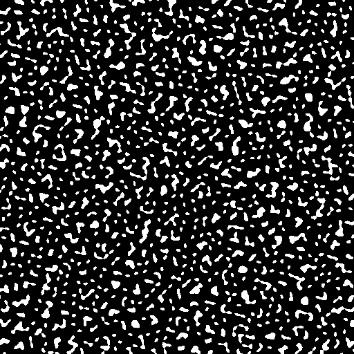

# Features — Feature Placement (Definition Reference)

Features decide **what** structures generate and **where**. A biome lists features per
generation *stage*; each feature pairs a **distributor** (where) with a **locator** (valid
positions) and a **structure** (what to place). Structures themselves live in
[`structures/`](../structures/) — the subdirectory layout here mirrors that one.

Contents:

1. [Branch vs base legend](#branch-vs-base-legend)
2. [Generation stages (the feature pipeline)](#generation-stages-the-feature-pipeline)
3. [Anatomy of a feature](#anatomy-of-a-feature)
4. [Distributors, locators, patterns](#distributors-locators-patterns)
5. [Stage blending (and how features bleed across biome borders)](#stage-blending)
6. [Screenshot placeholders](#screenshot-placeholders)

See the legend in [math/README.md](../math/README.md#branch-vs-base-legend): 🟢 base / 🔶 fork.
Feature configuration is 🟢 **base** Terra.

---

## Branch vs base legend

Features, distributors, locators, and the per-stage `blend:` are all 🟢 base Terra. The only
CHIMERA-specific consideration is *which* stages have blend configured (see below) and the
cave-biome interactions documented in agents.md.

---

## Generation stages (the feature pipeline)

`pack.yml` defines the ordered `stages:` (each `type: FEATURE`). Features run in this order,
top to bottom, after the chunk's terrain is carved:

| Stage | Purpose | Blend? |
|---|---|---|
| `global-preprocessors` | World-bottom lava etc. (defined only in `biomes/abstract/base.yml`). | no |
| `preprocessors` | Small pre-terrain modifications (e.g. powder-snow deposits). | no |
| `structures` | Mob rooms, desert wells, fossils. | no |
| `landforms` | Boulders & terrain-like features. | no |
| `slabs` | Slab smoothing of terrain. | no |
| `ores` | Ore generation (extend `biomes/abstract/features/ores`). | no |
| `deposits` | Dirt/andesite/gravel patches. | no |
| `river-decoration` | Biome-specific river features. | no |
| `trees` | Trees, ice spikes, large surface features. | **GAUSSIAN, amp 30** |
| `processors` | Post-tree / pre-flora (e.g. snow forest layers). | no |
| `underwater-flora` | Sea-grass etc. | no |
| `sculk` | Sculk. | no |
| `flora` | Tall grass, vines, small surface plants. | **GAUSSIAN, amp 30** |
| `postprocessors` | After everything (snow on trees). | no |
| `snow` | Snow layers. | no |
| `entities` | Entity placement. | no |

Only **`trees`** and **`flora`** have a global blend — features from neighbouring biomes bleed
up to ~30 blocks across borders. `landforms` and `preprocessors` have **no** blend. 🟢

```yaml
# pack.yml excerpt
- id: trees
  type: FEATURE
  blend:
    amplitude: 30
    sampler: { type: GAUSSIAN, salt: 2583 }
```

A biome wires features into stages by name:

```yaml
# biomes/land/cold/montane_forest.yml (excerpt)
features:
  flora:  [FERNS, GRASS]
  landforms: [BOULDERS, SMALL_BOULDER_PATCHES]
  slabs:  [SNOW_LAYERS]
  trees:  [DENSE_FIR_TREE_PATCHES, SPARSE_SPRUCE_TREES]
  preprocessors: [POWDER_SNOW_DEPOSITS]
  postprocessors: [TREE_SNOW, BLEND_SNOW]
```

---

## Anatomy of a feature

```yaml
id: ACACIA_BUSHES
type: FEATURE

distributor:                 # WHERE: density across the chunk
  type: SAMPLER
  sampler: { type: POSITIVE_WHITE_NOISE, salt: 465 }
  threshold: 0.01            # place where sampler > threshold

locator:                     # WHICH columns/heights are valid
  type: AND
  locators:
    - type: SURFACE
      range: &range { min: -54, max: 300 }
    - type: PATTERN          # require a plantable block below
      range: *range
      pattern:
        type: MATCH_SET
        blocks: $features/plantable/plantable.yml:plantable-blocks
        offset: -1
    - type: PATTERN          # require air/snow at the spot
      range: *range
      pattern: { type: MATCH_SET, blocks: [minecraft:snow, minecraft:air], offset: 0 }

structures:                  # WHAT to place
  distribution: { type: CONSTANT }
  structures: acacia_bush    # -> structures/.../acacia_bush.tesf
```

---

## Distributors, locators, patterns

- **Distributors** (`type:` under `distributor:`) — `SAMPLER` (threshold a noise sampler),
  `PADDED_GRID` (evenly-spaced slots with padding), `CONSTANT`, etc. `PADDED_GRID width:W
  padding:P` controls feature spacing (e.g. giant mushrooms). 🟢
- **Locators** — `SURFACE`, `PATTERN`, `AND`/`OR`, `RANDOM`, etc., constrain valid positions
  by Y range and surrounding blocks. 🟢
- **Patterns** — `MATCH_SET` (block ∈ set), `MATCH` (single block), at an `offset:` from the
  candidate position. A locator that only checks air/solid (no specific block) will fire on
  *any* open surface — including a foreign biome's cave floor when blended. 🟢

---

## Stage blending

Within a stage, a biome's own features are placed first, then the **blend layer from
neighbouring biomes is written on top** — so blended features win block overlaps. Because only
`trees` and `flora` blend, a tall feature (e.g. `GIANT_RED_MUSHROOMS`) from an adjacent cave
biome can overwrite the home biome's trees within ~30 blocks of the border.

The full case study (VINE_VAULT ← FUNGAL_UNDERGROWTH mushroom bleed) and the three suppression
options (`no-blend-tags`, locator block-guards, competing features) are in
[agents.md → Feature Stage Blending Reference](../agents.md#feature-stage-blending-reference). 🟢

---

## Screenshot placeholders

Feature *placement density* is best illustrated by rendering a distributor sampler with the
NoiseTool CLI (e.g. a `PADDED_GRID` or a thresholded noise). Placeholders until captured — see
[docs/CAPTURES.md](../docs/CAPTURES.md).

| What | Image |
|---|---|
| Example distributor density field |  |
