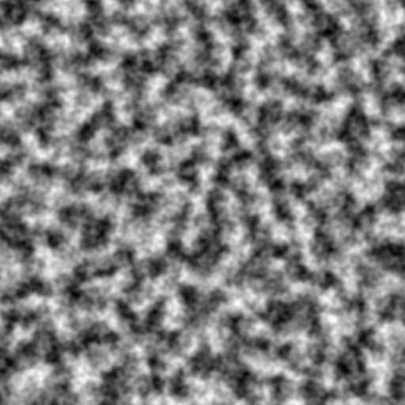
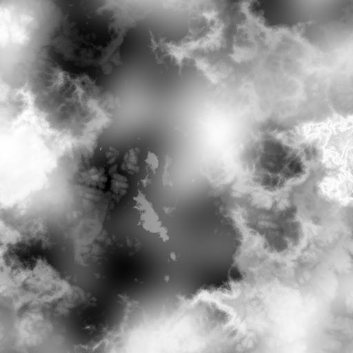
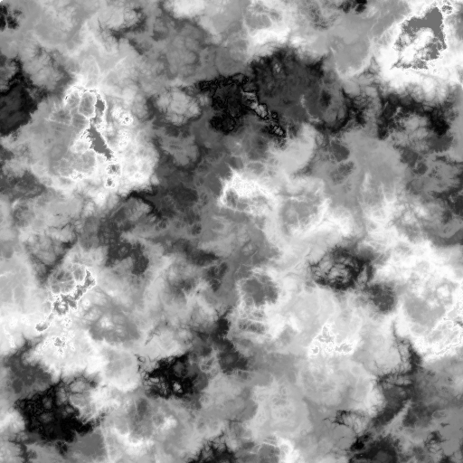
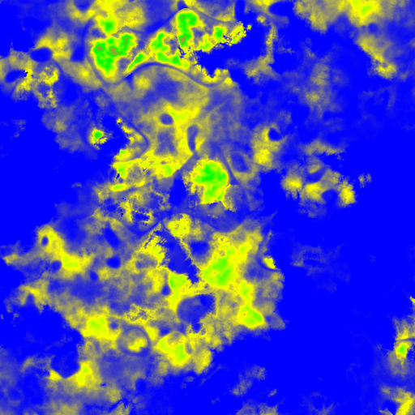

# Math — Functions & Samplers (Definition Reference)

This directory holds the **commonly-used noise samplers and math functions** that are
injected into the pack manifest (`pack.yml`) and shared across the whole pack, rather than
being redefined per biome. Single-use samplers/functions belong next to where they are used,
not here.

```
math/
  samplers/   Pack-level named noise samplers (the climate, terrain, river, cave drivers)
  functions/  Pack-level math functions (terrace shapers, interpolation, clamps, masks)
```

This README is the **gateway definition** for samplers in CHIMERA. It covers:

1. [Branch vs base legend](#branch-vs-base-legend)
2. [How samplers fit together](#how-samplers-fit-together)
3. [Sampler types — full catalogue](#sampler-types--full-catalogue) (every Terra `type:`)
4. [Normalizers & wrappers](#normalizers--wrappers)
5. [CHIMERA named samplers](#chimera-named-samplers) (each `math/samplers/*.yml` file)
6. [Math functions](#math-functions) (each `math/functions/*.yml` file)
7. [Visualising a sampler with the NoiseTool CLI](#visualising-a-sampler-with-the-noisetool-cli)

> Deep, hard-won operational notes (the FBM frequency trap, LinearNormalizer calibration,
> interpolation bleed, CELLULAR return ranges, EXPRESSION scoping rules) live in
> [agents.md → Sampler / Noise Reference](../agents.md#sampler--noise-reference). This file is
> the *definition*; agents.md is the *gotchas*. Read both before debugging a sampler.

---

## Branch vs base legend

CHIMERA targets the **diytechy "Abhorant vibe-coded" Terra fork**
(<https://github.com/diytechy/Terra>), not stock Polydev Terra. Throughout these docs:

- 🟢 **Base** — standard Polydev Terra 7. Works on upstream Terra and is documented at
  <https://terra.polydev.org/config/development/index.html>.
- 🔶 **Fork** — specific to the diytechy Terra build and/or a CHIMERA-bundled addon (e.g.
  the `dendry-noise` addon from <https://github.com/diytechy/DendryTerra>). Will **not** work
  on stock Terra without the matching addon/build.

When in doubt, the authoritative source for what the *current* build supports is the running
Terra source at `C:\Projects\Terra` and the addon registrations in
`common/addons/config-noise-function/.../NoiseAddon.java`.

---

## How samplers fit together

A **sampler** is a pure function `f(seed, x, z)` (2D) or `f(seed, x, y, z)` (3D) returning a
`double`. Samplers compose: a wrapper sampler (FBM, DOMAIN_WARP, CACHE, a normalizer, …) takes
an inner `sampler:` and transforms it. `EXPRESSION` samplers glue everything together with
math and can call other named samplers as functions.

CHIMERA's pack-level samplers are merged into `pack.yml` under `samplers:` from the files in
`math/samplers/`, and become callable by name (e.g. `temperature(x, z)`) inside any top-level
EXPRESSION across the pack.

```yaml
# pack.yml (excerpt) — every file here contributes named samplers
samplers:
  "<<":
    - math/samplers/elevation.yml:samplers
    - math/samplers/temperature.yml:samplers
    - math/samplers/precipitation.yml:samplers
    - math/samplers/continents.yml:samplers
    - math/samplers/rivers.yml:samplers
    # ... see pack.yml for the full list
```

**Default frequency is `0.02`** for every `NoiseFunction` sampler (≈50-block period). 🟢

---

## Sampler types — full catalogue

Every `type:` registered by the noise addon (`NoiseAddon.java`), grouped by role. Output
ranges and the per-type gotchas are expanded in
[agents.md → Output ranges by sampler type](../agents.md#output-ranges-by-sampler-type).

### Noise sources

| `type:` | Output range | Notes | Branch |
|---|---|---|---|
| `OPEN_SIMPLEX_2` | `[-1, 1]` | Default workhorse; smooth, quasi-Gaussian about 0. | 🟢 |
| `OPEN_SIMPLEX_2S` | `[-1, 1]` | Smoother ("super") variant. | 🟢 |
| `PERLIN` | `[-1, 1]` | Classic Perlin. | 🟢 |
| `SIMPLEX` | `[-1, 1]` | Classic simplex. | 🟢 |
| `VALUE` | `[-1, 1]` | Value noise (blocky, cheap). | 🟢 |
| `VALUE_CUBIC` | `[-1, 1]` | Cubic-interpolated value noise. | 🟢 |
| `WHITE_NOISE` | `[-1, 1]` | Per-coordinate hash; no spatial coherence. | 🟢 |
| `POSITIVE_WHITE_NOISE` | `[0, 1]` | White noise mapped to non-negative. Used as feature distributor. | 🟢 |
| `GAUSSIAN` | unbounded (≈ N(0,1)) | Gaussian white noise. Used as blend sampler in `pack.yml` stages. | 🟢 |
| `CELLULAR` | depends on `return:` | Voronoi/Worley. Default `return: Distance` → `[-1, 0.207]`. Other returns: `CellValue [-1,1]`, `Distance2Div [1,∞)`, `NoiseLookup` (range of `lookup:`). | 🟢 |
| `GABOR` | sampler-dependent | Gabor kernel noise (oriented bands). | 🟢 |
| `PSEUDOEROSION` | sampler-dependent | Erosion-style ridged terrain. **Note the registered key is `PSEUDOEROSION`** (no underscore). | 🟢 |
| `DISTANCE` | distance metric | Distance-to-feature sampler. | 🟢 |
| `CONSTANT` | the `value:` you set | Spatially uniform. DOMAIN_WARP around a CONSTANT is a no-op (common debug leftover). | 🟢 |
| `KERNEL` | sampler-dependent | Convolution-kernel sampler. | 🟢 |
| `LINEAR_HEIGHTMAP` | sampler-dependent | Treats a sampler as a heightmap (y-aware). | 🟢 |
| `DENDRY` | sampler-dependent | **Dendritic river/valley networks.** Provided by the bundled `dendry-noise` addon. Not in stock Terra. | 🔶 |

```yaml
# OPEN_SIMPLEX_2 example
type: OPEN_SIMPLEX_2
frequency: 0.01      # ~100-block period
salt: 3              # decorrelate from other samplers sharing the seed
```

```yaml
# CELLULAR example — note the return type drives the output range
type: CELLULAR
frequency: 0.08
return: CellValue    # per-cell random constant in [-1, 1]
```

### Fractals (octave stackers)

| `type:` | Output | Notes | Branch |
|---|---|---|---|
| `FBM` | `[-1, 1]` | Fractional Brownian motion; sums octaves. Normalized via `1/Σamplitudes`. | 🟢 |
| `RIDGED` | `[-1, 1]` | Ridged multifractal (sharp ridges). | 🟢 |
| `PING_PONG` | `[-1, 1]` | Ping-pong fractal (folded). | 🟢 |

> ⚠️ **The FBM `frequency:` field is dead code.** The spatial scale of an FBM is set entirely
> by the **inner leaf** `sampler:`'s frequency. See agents.md. 🟢

```yaml
type: FBM
octaves: 3
gain: 0.5
sampler:
  type: OPEN_SIMPLEX_2
  frequency: 0.01    # <-- set scale HERE, not on the FBM
```

### Transforms & combinators

| `type:` | Role | Branch |
|---|---|---|
| `DOMAIN_WARP` | Evaluates the inner sampler at coordinates displaced by a `warp:` sampler. Does **not** change the inner output range — only *where* it is sampled. | 🟢 |
| `TRANSLATE` | Shifts the sample coordinates by fixed `x`/`y`/`z` offsets (used to decorrelate fields, e.g. temperature `x:10000 z:10000`). | 🟢 |
| `CACHE` | Memoises the inner sampler's value per coordinate (perf optimisation for expensive sub-trees). | 🟢 |
| `ADD` `SUB` `MUL` `DIV` `MAX` `MIN` | Binary arithmetic on two samplers. Prefer `EXPRESSION` for readability unless you need a leaf node. | 🟢 |
| `EXPRESSION` | Paralithic math expression over `x,z`(`,y`), constants, `variables:`, `functions:`, and named/local samplers. The glue of the whole pack. | 🟢 |

```yaml
# DOMAIN_WARP — warp amplitude is a DISPLACEMENT in blocks, not an output range
type: DOMAIN_WARP
amplitude: 30
warp:
  type: LINEAR        # normalize the warp sampler's range into [-1, 1] first
  min: -1
  max: 0.2            # matches CELLULAR Distance max (√2-1)/2 ≈ 0.207
  sampler:
    type: CELLULAR
    frequency: 0.08
sampler:
  type: FBM
  sampler: { type: OPEN_SIMPLEX_2, frequency: 0.01 }
```

```yaml
# EXPRESSION — named samplers arrive as callable functions
type: EXPRESSION
expression: temperature(x, z) - lerp(elevation(x, z), 64, 0, 1, 0.02)
functions: $math/functions/interpolation.yml:functions
samplers:
  temperature: $math/samplers/temperature.yml:samplers.temperature
  elevation:   $math/samplers/elevation.yml:samplers.elevation
```

> EXPRESSION **function bodies are pure math** — they cannot see sibling functions, local
> samplers, or pack-level samplers. Evaluate sampler calls at the top level and pass the
> results as arguments. Full rules in
> [agents.md → EXPRESSION sampler scoping rules](../agents.md#expression-sampler-scoping-rules). 🟢

---

## Normalizers & wrappers

Normalizers remap an inner sampler's output. All are registered by the noise addon. 🟢

| `type:` | Maps to | Notes |
|---|---|---|
| `LINEAR` | `[-1, 1]` | `(in − min)·2/(max − min) − 1`. **Does NOT clamp** out-of-range inputs — they extrapolate. Calibrate `min`/`max` to the inner sampler's *actual* range. |
| `LINEAR_MAP` | arbitrary `[to-min, to-max]` | Linear remap with explicit target range. |
| `CLAMP` | `[min, max]` | Hard clamp. |
| `SCALE` | scaled | Multiplies by a constant. |
| `NORMAL` | normalised | Maps assuming a normal distribution. |
| `PROBABILITY` | `[0, 1]`-ish | Probability normalisation (used inside DENDRY control samplers). |
| `POSTERIZATION` | stepped | Quantises into N discrete levels. |
| `CUBIC_SPLINE` | spline curve | Maps input through control points (terrain shaping curves). |
| `EXPRESSION_NORMALIZER` | expression | Apply an arbitrary expression to the inner value. |

```yaml
# LINEAR normalizer — calibrate min/max to the inner range or you get unidirectional warps
type: LINEAR
min: -1
max: 0.2
sampler:
  type: CELLULAR     # default return: Distance, range [-1, 0.207]
  frequency: 0.08
```

---

## CHIMERA named samplers

Each file in `math/samplers/` contributes one or more named samplers. The most important
named samplers (the ones called from biome equations, climate stages, and EXPRESSION fields)
are listed per file. To **see** any of these, render them with the NoiseTool CLI (see below).

| File | Defines | Key named samplers | Branch |
|---|---|---|---|
| `continents.yml` | Land/ocean macro shape | `continents`, `continentalDistribution` | 🟢 base concept |
| `elevation.yml` | Surface height field | `elevation`, `elevationWithRivers`, `elevationDetailed`, `compositeElevation`* | 🟢/🔶 mixed |
| `temperature.yml` | Temperature climate | `rawTemperature`, `temperature` (with altitude lapse) | 🟢 base concept |
| `precipitation.yml` | Precipitation climate | `rawPrecipitation`, `precipitation` | 🟢 base concept |
| `rivers.yml` | River distance/placement | `continentalRiverDist`, `continentalRiverSupportDensity`, far-river grids | 🔶 fork (river support density feeds the fork's `terrain.min-density`) |
| `rifts.yml` | Rift/canyon regions | `riftRegions`, `riftContinents`, `cold_pit`, `warm_pit`, `riftLandDistributor` | 🔶 fork |
| `trenches.yml` | Ocean trenches | trench distance/shape samplers | 🔶 fork |
| `spots.yml` | Point features (volcanoes, sinkholes, special caves) | `special_caves`, `special_caveDist`, `platforms`, `spotTemperature`, `spotPlacer` | 🔶 fork |
| `special_cave_carving.yml` | Special-cave carvers | carving samplers for `EQ_INFERNO_ISLE` et al. | 🔶 fork |
| `spawnIsland.yml` | Spawn-area island | spawn island shaping | 🟢 base concept |
| `simplex.yml` | Shared simplex helpers | generic reusable simplex leaves | 🟢 |
| `biomes_small.yml` / `biomes_large.yml` / `biomes_ocean.yml` | Biome-shape selector fields | `BiomeShapeLandmassTemperature`, `BiomeShapeOceanValue`, `BiomeShapeMesaTemperature`, … (drive the climate distribution stages) | 🟢 base concept |

\* `compositeElevation` is referenced by the NoiseTool color-sampler design (see the NoiseTool
`Claude.md`); confirm its presence in `.artifacts/resolved_samplers.yml` before relying on it.

**Worked example — the `temperature` sampler** (`temperature.yml`), showing the metaconfig +
TRANSLATE + FBM composition and the altitude lapse correction:

```yaml
rawTemperature:
  dimensions: 2
  type: EXPRESSION
  expression: sampler(x / temperatureScale / globalScale, z / temperatureScale / globalScale) * temperatureSpread + temperatureOffset
  variables:
    globalScale:      $customization.yml:global-scale
    temperatureScale: $customization.yml:temperature-scale
    temperatureOffset: (${customization.yml:temperature-max}+${customization.yml:temperature-min})/2
    temperatureSpread: (${customization.yml:temperature-max}-${customization.yml:temperature-min})/2
  samplers:
    sampler:
      type: TRANSLATE          # decorrelate from precipitation by shifting coords
      x: 10000
      z: 10000
      sampler:
        type: FBM
        gain: 0.3
        octaves: 2
        sampler: { type: OPEN_SIMPLEX_2, salt: 3, frequency: 1 / 5000 }

temperature:
  dimensions: 2
  type: EXPRESSION
  expression: rawTemperature(x, z) - lerp(tempElevationReference(x, z), lapseStart, 0, 1, lapseRate)
```

> The FBM/OpenSimplex output is **not uniform** — it is quasi-Gaussian about 0, so climate
> bands at the *edges* of the weight list (ice-cap, rainforest) capture less than nominal.
> This is why climate weights are asymmetric. See
> [agents.md → The non-uniform noise distribution](../agents.md#the-non-uniform-noise-distribution). 🟢

---

## Math functions

Files in `math/functions/` are merged into `pack.yml → functions:` and become callable in any
top-level EXPRESSION across the pack.

| File | Functions | Purpose | Branch |
|---|---|---|---|
| `terrace.yml` | `terrace`, `terraceStrata`, `terraceParabolic`, `terraceParalinear` | Step-function height shapers. **All variants only ever subtract from the input** (max output = input). | 🟢 |
| `interpolation.yml` | `lerp`, `lerp3`, `herp`, … | Linear/Hermite interpolation. `lerp3` re-declares `lerp` as a nested child (functions can't see siblings). | 🟢 |
| `clamp.yml` | `clamp`, … | Range clamping helpers. | 🟢 |
| `maskSmooth.yml` | `smoothstep`-style mask blends | Smooth region masking. ⚠️ `smoothstep(edge0, edge1, x)` with `edge0 > edge1` always returns 0 — invert instead: `1 - smoothstep(0, max, x)`. | 🟢 |
| `shelf.yml` | `shelf`, … | Continental-shelf / coastal step shaping. | 🟢 |

Terrace algebra, smoothstep inversion traps, and chained-terrace envelopes are detailed in
[agents.md → Terrace functions](../agents.md#terrace-functions-mathfunctionsterraceyml). 🟢

---

## Visualising a sampler with the NoiseTool CLI

The NoiseTool can render any sampler to a PNG headlessly — used to produce the screenshots
below and to validate sampler YAML (it exits non-zero and prints the compile error on failure).
Full flag reference: `C:\Projects\NoiseTool\README.md`.

**Recipe for a named CHIMERA sampler:**

1. Regenerate the resolved samplers file (so named samplers are in scope):
   `python .scripts\resolve_samplers.py` → `.artifacts\resolved_samplers.yml`.
2. Use a one-line stub from [docs/noise/](../docs/noise/) that calls the sampler, e.g.
   `temperature.yml` containing `expression: temperature(x, z)`.
3. Render:

   ```bat
   RenderNoise.bat --common C:\Projects\CHIMERA\.artifacts\resolved_samplers.yml ^
     --in C:\Projects\CHIMERA\docs\noise\temperature.yml ^
     --out C:\Projects\CHIMERA\docs\img\samplers\temperature.png ^
     --seed 2403 --size 512x512 --multiplier 24 --color-scale grayscale
   ```

The CLI filters unused samplers automatically (e.g. "Filtered samplers: 25 of 197 referenced"),
so pointing `--common` at the full resolved file is cheap.

### Screenshot placeholders

> These images are **placeholders** until captured. Regenerate them with the commands in
> [docs/CAPTURES.md](../docs/CAPTURES.md).

| Sampler | Image | Color scale |
|---|---|---|
| FBM demo (standalone) |  | grayscale |
| `temperature` |  | grayscale |
| `precipitation` |  | grayscale |
| `continents` |  | grayscale (threshold 0 = coast) |
| `elevation` |  | terrain (0–320) |

> Note: `elevation`, `temperature`, `precipitation` and `continents` are **normalised** fields
> (roughly `[0, 0.6]` for `elevation`, `[-1, 1]` for the climates), **not** raw world heights.
> The elevation stub (`docs/noise/elevation.yml`) multiplies by ~320 so the `terrain` color
> scale reads it as world height; render the climates with the default grayscale-normalised
> scale. The "Colored 0 - 320" / `terrain` scale only makes sense for samplers that output
> actual world Y.
