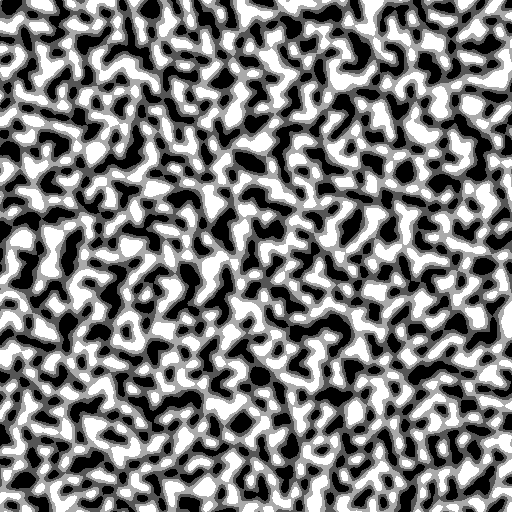

# Palettes (Definition Reference)

Palettes define **what blocks make up the base terrain column** of a biome — the surface,
sub-surface, and deep layers. Biomes reference palettes from their `palette:` and `slant:`
keys (see [biomes/README.md](../biomes/README.md#anatomy-of-a-biome-config)).

Files are grouped into loosely-defined subdirectories by the kind of biome/area they serve
(`grass/`, `sand/`, `snowy/`, `cave/`, `ocean/`, `rock_layers.yml`, …).

Contents:

1. [Branch vs base legend](#branch-vs-base-legend)
2. [Anatomy of a palette](#anatomy-of-a-palette)
3. [Material selection (how the sampler picks a block)](#material-selection)
4. [Slant & depth palettes](#slant--depth-palettes)
5. [Screenshot placeholders](#screenshot-placeholders)

Legend (see [math/README.md](../math/README.md#branch-vs-base-legend)): palette configuration
is 🟢 **base** Terra.

---

## Branch vs base legend

The palette schema and material-selection math are 🟢 base Terra. The only fork-relevant
interaction is the slant *calculation method* (🔶 `DotProduct`, set in `pack.yml`), which
changes how `slant:` thresholds in biome configs map onto palettes — see
[biomes/README.md](../biomes/README.md#terrain-equations--elevation-constraints).

---

## Anatomy of a palette

```yaml
id: GRASS
type: PALETTE
layers:
  - materials: [minecraft:grass_block: 1]   # top layer
    layers: 1                               # 1 block thick
  - materials: [minecraft:dirt: 2]
    layers: 1
  - materials: [minecraft:stone: 1]         # everything below
    layers: 1
```

Layers are applied top-down from the surface. Each layer has a weighted `materials:` list and a
`layers:` thickness. A top-level (or per-layer) `sampler:` selects among the weighted materials.

---

## Material selection

The `sampler:` chooses a material within a layer's weighted list:

1. Weights expand into an array — `[dirt:3, sand:2]` → `[dirt,dirt,dirt,sand,sand]` (length 5).
2. `value = sampler.getSample(seed, x, y, z)`.
3. `index = clamp(floor((value + 1) / 2 * length), 0, length − 1)`.

**This hard-assumes the sampler output is in `[-1, +1]`.** Values outside clamp to the first
(`< −1`) or last (`> +1`) material — so YAML order matters for the clamp behaviour. For
`[dirt:3, sand:2]` the boundary is at sampler value `0.2` (dirt below, sand at/above). 🟢

> A **2D sampler returns the same value for every Y** at a given `(x, z)` → material patches are
> vertical columns, never per-block. At default `frequency: 0.02` patches are ~25 blocks wide,
> so a small test area can sit entirely inside one patch. Full details in
> [agents.md → PALETTE material selection](../agents.md#palette-material-selection). 🟢

---

## Slant & depth palettes

A biome's `slant:` entries swap in a different palette on steep terrain:

```yaml
slant:
  - threshold: 0.4          # 🔶 DotProduct: fires where slant < 0.4 (steeper)
    palette:
      - BLOCK:minecraft:stone: $meta.yml:top-y
      - << meta.yml:palette-bottom
```

With DotProduct, slant ∈ `[-1, 1]`; sane thresholds are `0.3–0.8` (anything > 1.0 always fires).
`slant-depth: N` is a **layer-count limit** (how deep the slant palette applies), not a value
scaler. See [biomes/README.md](../biomes/README.md#terrain-equations--elevation-constraints)
and `tools/slant_convert.py`.

---

## Screenshot placeholders

A palette-selection sampler can be visualised with the NoiseTool CLI (render the selection
sampler; patch boundaries appear where it crosses the material thresholds). Placeholders until
captured — see [docs/CAPTURES.md](../docs/CAPTURES.md).

| What | Image |
|---|---|
| Material-selection sampler (patch layout) |  |
